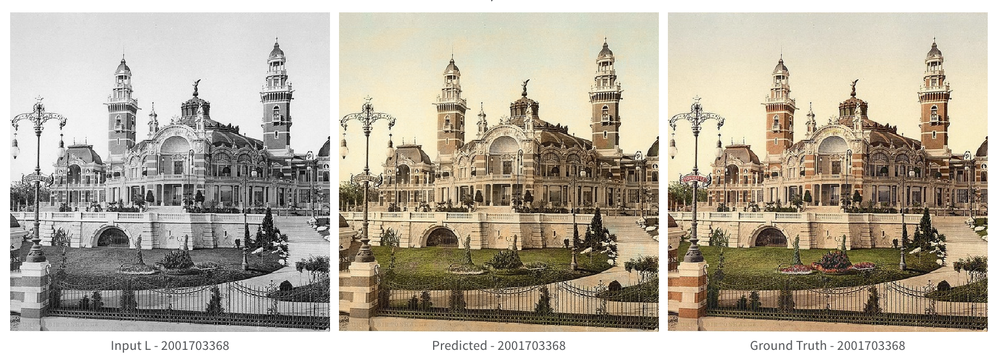
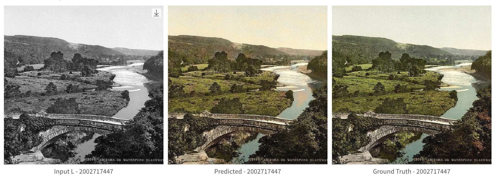
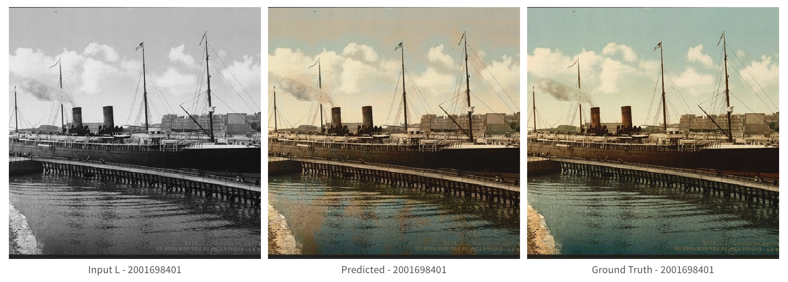

# PhotochromAI

A personal deep learning project that automatically colorizes black-and-white photographs in the style of historical photochroms. Built as a fun exploration of computer vision techniques and an excuse to experiment with HPC training infrastructure.

## About Photochroms

Photochroms were a fascinating color photography technique from the 1890s-1950s where skilled artisans hand-colored black-and-white photographs using lithographic stones, creating vibrant travel postcards that captured the world in color decades before color film existed. These beautiful prints documented everything from European cityscapes to American national parks.

I've always been fascinated by these historical images, so I built this project to see if I could teach a neural network to recreate that distinctive photochrom aesthetic automatically.

## Dataset

This project uses the [Library of Congress Photochrom Print Collection](https://www.loc.gov/pictures/collection/pgz/), a digitized archive of nearly 6,000 photolithographic travel prints from the 1890s-1910s. The collection includes richly colored images of Europe, the Middle East, and North America, created by the Photoglob Company in Zürich and the Detroit Publishing Company. These historical images provide an ideal training dataset for learning photochrom-style colorization.

## Results

<table>
<tr>
<td><br/>Good result</td>
<td><br/>Decent result</td>
<td><br/>Struggles with fine details</td>
</tr>
</table>

## Technical Approach

- **U-Net Architecture**: Encoder-decoder CNN with skip connections for preserving fine details
- **LAB Color Space**: Works in perceptually uniform LAB space rather than RGB for better color prediction
- **PyTorch Lightning**: Clean, scalable training code with automatic GPU/multi-GPU support
- **Experiment Tracking**: Weights & Biases integration for monitoring training progress and visualizing results
- **HPC-Ready**: SLURM job scripts for training on university compute clusters
- **Configurable**: Hydra configuration system for easy hyperparameter experimentation

## Usage

### Training
```bash
# Basic training
python training/train.py

# Custom model configuration
python training/train.py model.name=unet_large

# Resume from checkpoint
python training/train.py trainer.ckpt_path=checkpoints/model_name/last.ckpt
```

### SLURM Training
```bash
bash scripts/run_slurm.sh model_name
```

## How It Works

The model takes a grayscale image (L channel in LAB color space) and predicts the corresponding color channels (a and b channels). The U-Net architecture learns to map from lightness values to color information by training on thousands of historical photochrom pairs. Results vary - it does well on landscapes and architecture but struggles with fine details like faces or intricate patterns.

## Configuration

Configuration files are located in `configs/`:
- `configs/model/unet.yaml` - Model architecture settings
- `configs/trainer/` - Training parameters
- `configs/default.yaml` - Default configuration

## Requirements

- PyTorch
- PyTorch Lightning  
- Hydra
- scikit-image
- Weights & Biases
- PIL/Pillow